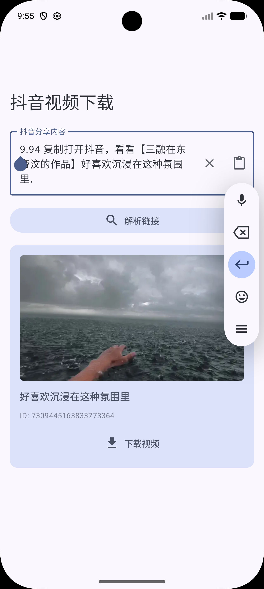
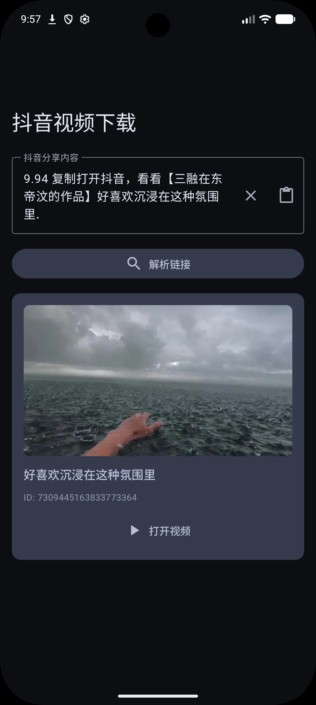

<div align="center">

# DouyinDL

一个简洁的抖音无水印视频下载工具

[](https://www.gnu.org/licenses/agpl-3.0)
[](https://developer.android.com)

</div>

## 截图

| 浅色 | 深色 |
|------|------|
|  |  |

## 系统要求

- Android 8.0 (API 26) 及以上

## 构建

生成签名密钥：

```bash
keytool -genkey -v -keystore app/release.jks -keyalg RSA -keysize 2048 -validity 10000 -alias your_key_alias
```

在 `local.properties` 中配置签名信息：

```properties
RELEASE_STORE_FILE=release.jks
RELEASE_STORE_PASSWORD=your_store_password
RELEASE_KEY_ALIAS=your_key_alias
RELEASE_KEY_PASSWORD=your_key_password
```

构建 Release APK：

```bash
./gradlew assembleRelease
```

产物位于 `app/build/outputs/apk/release/`，按 ABI 分包（arm64-v8a、armeabi-v7a、x86、x86_64、universal）。

## License

AGPL-3.0
